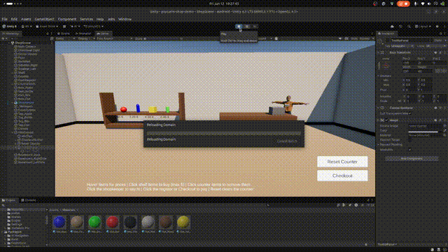

# PsyCurio Shop Demo 🛒

A small interactive Unity shop scene built for the PsyCurio test task: pick items from a shelf, manage your cart directly on the counter, chat with the shopkeeper, and check out through a friendly two-step purchase flow — all with a fixed camera and mouse clicks, playable entirely in the Unity editor.



---

## Requirements & Tech Stack

| | |
|---|---|
| **Unity** | 6.3 LTS (6000.3.17f1) |
| **Render Pipeline** | Universal Render Pipeline (URP) |
| **Build Target** | Android (.apk), IL2CPP, ARM64 — build verified |
| **Input** | Unity Input System (new), mouse only |
| **Character & Animations** | Mixamo (idle, wave) |
| **UI** | TextMeshPro (world-space speech bubble, tooltips, hint bar, checkout buttons) |

The scene requires no XR packages and runs fully in the editor, as specified in the task.

## How to Run

1. Clone the repository and open the project in **Unity 6.3 LTS** (Unity Hub → Add → select the folder).
2. Open the scene: `Assets/Scenes/ShopScene.unity`.
3. Press **Play** — the shopkeeper greets you with a wave.

### Controls
- **Hover** any item → tooltip with its name and price
- **Left-click a shelf item** → a copy flies onto the counter (max 5, duplicates allowed)
- **Left-click an item on the counter** → removes it from your cart (remaining items close the gap)
- **Left-click the shopkeeper** → she waves and says hi
- **Left-click the register or the Checkout button** → itemized receipt appears and the shopkeeper asks *"Shall I pack everything up for you?"*
- **"Yes, pack it up!"** → she confirms the final receipt, thanks you with a wave, and the counter clears
- **Reset Counter** → clears the cart instantly for a fresh start

### Android Build
`File → Build Profiles → Android → Build`. The project is configured for IL2CPP / ARM64 with ShopScene in the scene list; a successful `.apk` build has been verified locally (interactions are mouse-based and editor-only, per the task brief).

## Implemented Features

**Core task**
- Shelf with multiple purchasable items; clicking places a copy on the counter (max 5)
- Shopkeeper (Mixamo character) idling beside the counter; waves when clicked
- Register click → itemized purchase summary with per-line prices and total

**Additional task (chosen: effects)**
- Purchased items **fly from the shelf to the counter** along a parabolic arc with a spin
- **Particle burst** and **sound effects** (whoosh in flight, pop on landing)

**Cart & checkout UX**
- **Itemized live receipt**: every line shows quantity × item and its price, with the total at the end; the receipt updates in real time as items are added or removed
- **Removable cart**: clicking any item on the counter removes it; remaining items slide together
- **Two-step conversational checkout**: receipt + *"Shall I pack everything up for you?"* → explicit **"Yes, pack it up!"** confirmation (no surprise auto-checkout); the shopkeeper waves goodbye with the final receipt
- **Reset Counter** button to clear everything at once
- Checkout/Reset buttons appear only when the cart has items; the receipt opens automatically when the counter is full

**General UX & presentation**
- Welcome greeting with a wave when the scene starts
- Hover tooltips (name + price on shelf items, "click to remove" on counter items) and hover scaling on every interactive object
- Readable price labels on the shelf with backing plates
- Spoken feedback for all edge cases (counter full, empty checkout, emptied cart)
- Two-line on-screen hint bar explaining every control
- Composed camera angle and dressed scene: paneled shelf furniture, enclosing walls, baseboard trim, warm lighting with soft shadows, ACES tonemapping, bloom and vignette

## Improvements After Feedback

All review points from the first submission were addressed:

| Feedback | Change |
|---|---|
| Prices barely readable | Compact bold price labels on white plates + hover tooltips with name and price |
| Presentation/camera | New diagonal camera composition; shelf rebuilt as furniture with side panels; side walls and baseboards enclose the room |
| Wave animation cut off | Animator transition exit time corrected so the wave plays through fully |
| Speech text too close to the head | Speech bubble repositioned and given a solid readable background |
| Receipt as itemized list | Per-line quantities and prices with the total at the end |
| Automatic checkout was surprising | Replaced with an explicit two-step confirmation ("Shall I pack everything up?" → "Yes, pack it up!") plus a Reset option |
| Removing items from the cart | Counter items are clickable to remove, with tooltip affordance |
| Bubble should react to state changes | The receipt is live — it refreshes immediately on every cart change |

## Architecture Overview

```
ClickManager ──raycast──▶ IClickable (click)  &  IHoverInfo (tooltips)  &  HoverHighlight (scale)
                            ├── ShelfItem ───▶ ShopManager.TryBuy
                            ├── CounterItem ─▶ ShopManager.RemoveItem
                            ├── Shopkeeper (wave, speech)
                            └── CashRegister ▶ ShopManager.OnRegisterClicked

ShopManager (cart state machine: Shopping ⇄ Confirming)
   ├─ counter slots, fly effect, particles, audio
   ├─ Checkout / Reset UI buttons (shown only when cart has items)
   └─ Shopkeeper.Speak / SpeakPersistent ──▶ SpeechBubble (world-space, billboarded, live-updating)

Tooltip (screen-space, follows cursor, driven by ClickManager hover)
```

- One `ClickManager` raycasts clicks and hover; interactive behavior is added by implementing small interfaces (`IClickable`, `IHoverInfo`) — no input code changes needed for new objects.
- Item definitions (`name`, `price`) are **ScriptableObjects** (`ItemData`), so the inventory is data-driven.
- `ShopManager` owns the cart as a simple two-state machine (Shopping → Confirming), which keeps the conversational checkout logic explicit and testable.

## AI Tool Disclosure

As invited in the task instructions, I used **Claude (Anthropic)** as a development assistant throughout this project, in a pair-programming style:

- **Code**: drafting the C# scripts (click system, shop logic, speech bubble, effects), which I then integrated, wired up in the editor, tested, and iterated on
- **Guidance**: Debugging support based on screenshots of issues I hit

All Unity editor work — scene construction, component wiring, animation setup, materials, lighting, UI layout, testing, and all UX decisions — was done by me, and the step-by-step commit history documents the actual development process. I see directing AI tools effectively while owning and understanding the result as part of my engineering workflow.

## Future Extension Ideas (AI × VR)

Ways I would extend this demo toward PsyCurio's domain, given more time:

1. **LLM-driven shopkeeper dialogue** — replace canned lines with a small local or API-based language model so the shopkeeper converses naturally, remembers the customer's purchases, and adapts her personality; with graceful fallback to scripted lines when offline.
2. **Voice interaction** — speech-to-text input so users can talk to the shopkeeper hands-free, which maps directly to VR where keyboards are unavailable.
3. **Behavioral interaction analytics** — log gaze/click/hesitation patterns during shopping tasks; in a VR-psychology context, such interaction traces can support assessment and training scenarios.
4. **Computer-vision-driven embodiment** — using pose estimation to mirror the user's gestures onto an avatar for richer social presence.

## Credits

- Character and animations: [Mixamo](https://www.mixamo.com) (Adobe)
- Sound effects: [freesound.org](https://freesound.org) — 
- Built with Unity 6.3 LTS & Universal Render Pipeline

---

**Aryan Kumar Singh (AK)** · [GitHub](https://github.com/aksingh1608) · [Portfolio](https://bewithaksingh.com)